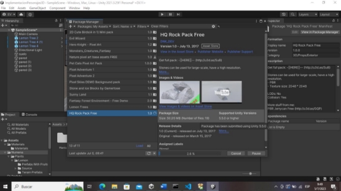

## Nota: Buenas tardes, días o noches ingeniero si esta viendo este mensaje, es porque entro al repositorio, le dejo este mensaje debido a que me equivoque al subir el informe con la otra tarea, debido a que asumí que esta era la tarea enviada a la casa, en la parte de abajo esta mi informe de igual manera le adjunto un link de google drive [Documento](https://drive.google.com/file/d/1cCpUpMLpiHGTFXJvU15nWB5-5MRwXOOR/view?usp=sharing) Gracias de antemano.

|**UNIVERSIDAD DE LAS FUERZAS ARMADAS ESPE SEDE LATACUNGA** ||
| :-: | :- |
|**ESTUDIANTE** |Telleria Vasco Elias Ibrahim |
|**ASIGNATURA** |Desarrollo de Videojuegos – 9941 |
|**FECHA** |2023-07-05 |

|**1.  ANTENCEDENTES** |
| - |
|
La resolución de problemas y la manipulación de clases y objetos son elementos fundamentales en la programación orientada a objetos (POO), un paradigma en el que las estructuras de datos están diseñadas para modelar el mundo real. Según Grady Booch, uno de los pioneros en la POO, "la programación orientada a objetos es un método de implementación en el que los programas se organizan como colecciones cooperativas de objetos, cada uno de los cuales representa una instancia de alguna clase y cuyas clases son todas miembros de una jerarquía de clases unida vía relaciones de herencia" (Booch, 1994). 

En el contexto del desarrollo de videojuegos, la utilización de clases y objetos es imprescindible, ya que permite la modelización de entidades complejas como personajes, enemigos, objetos interactivos, etc. De acuerdo con Jason Gregory, en su libro "Game Engine Architecture", estas entidades se benefician de la encapsulación, la herencia y el polimorfismo, conceptos fundamentales en la POO. 

La interacción videojuego-usuario es otro componente crítico en el diseño de juegos. Como señala Katie Salen en su libro "Rules of Play: Game Design Fundamentals", un videojuego se define por la relación entre sus reglas (la mecánica del juego), su sistema de metas y la interacción del usuario con estos elementos. En esta interacción, los personajes juegan un papel fundamental, ya que son el principal medio a través del cual los jugadores interactúan con el mundo del juego. 

Por último, existe una creciente tendencia en el desarrollo de videojuegos a utilizar problemas y ejercicios relacionados con clases y objetos para entrenar habilidades de pensamiento crítico y resolución de problemas. Como sugiere James Paul Gee en "What Video Games Have to Teach Us About Learning and Literacy", los videojuegos son medios poderosos para fomentar el aprendizaje y la resolución de problemas, ya que requieren que los jugadores apliquen y desarrollen estas habilidades de manera constante. 
|

|**2.  OBJETIVOS** |
| - |
|
- Explorar la utilización de clases y objetos en la creación de personajes para videojuegos, incluyendo la modelización de sus atributos y comportamientos. 

- Examinar la interacción videojuego-usuario a través de personajes, incluyendo la interfaz de usuario y las técnicas de control. 

- Diseñar y aplicar una serie de problemas y ejercicios basados en clases y objetos que ayuden a desarrollar habilidades de resolución de problemas en los jugadores. 
|

|**3.  DESARROLLO** |
| - |
|**Creamos un nuevo proyecto** |

Seguido de esto creamos una estructura básica de directorios 

Creamos un terreno para nuestro personaje que va a ser el suelo 

Luego agregamos un objeto que nos servirá como pared, y lo duplicamos y ajustamos a nuestro escenario 

Luego agregamos, texturas a nuestro escenario 

Agregamos más elementos a nuestro proyecto para el entorno 

Y los agregamos al escenario 

Luego agregamos a nuestro personaje y lo configuramos como un tipo humanoid 

Agregamos un carácter controller a nuestro jugador 

Luego arrastramos la cámara principal a nuestro jugador para hacer una visión en tercera persona 

Creamos un script para manejar el movimiento de nuestro jugador. 

Luego agregamos un animator y un animator controller a nuestro jugador 

Agregamos los parámetros a nuestro animator 

|**4. **CONCLUSIONES** |
| - |
|
Las clases y objetos demostraron ser esenciales en la creación de personajes de videojuegos. Su uso permitió una modelización efectiva y eficiente de los personajes, incluyendo sus atributos y comportamientos, permitiendo un mayor nivel de complejidad y realismo. 

La  interacción  videojuego-usuario  se  mejoró  significativamente  a  través  de  personajes  bien diseñados. La interfaz de usuario y las técnicas de control que se implementaron resultaron ser intuitivas y efectivas, mejorando la experiencia de juego y facilitando la inmersión del jugador en el mundo del juego. 

Los problemas y ejercicios basados en clases y objetos resultaron ser herramientas útiles para desarrollar habilidades de resolución de problemas en los jugadores. Estos problemas y ejercicios 
|

proporcionaron retos  que  requerían  un  pensamiento crítico  y  estratégico, estimulando  así  el aprendizaje y la mejora en estas áreas.. 

|**5.  REPOSITORIO** |
| - |
|[https://github.com/tellxmaster/Entorno3D ](https://github.com/tellxmaster/Entorno3D) |

|||
| :- | :- |
|
*0—Introduction | Photon Engine*. (s. f.). Recuperado 3 de julio de 2023, de 

[https://doc.photonengine.com/pun/current/demos-and-tutorials/pun-basics- tutorial/intro ](https://doc.photonengine.com/pun/current/demos-and-tutorials/pun-basics-tutorial/intro)

Info Gamer (Director). (2019, abril 12). *Unity Multiplayer Tutorial—Photon 2 Setup (Part 1)*. 

[https://www.youtube.com/watch?v=02P_mrszvzY ](https://www.youtube.com/watch?v=02P_mrszvzY)

*Introduction to Multiplayer Games With Unity and Photon*. (s. f.). Kodeco.Com. Recuperado 3 de julio de 2023, de[ https://www.kodeco.com/1142814-introduction-to-multiplayer-games-](https://www.kodeco.com/1142814-introduction-to-multiplayer-games-with-unity-and-photon)

[with-unity-and-photon ](https://www.kodeco.com/1142814-introduction-to-multiplayer-games-with-unity-and-photon)

*Setting up Photon Unity Networking*. (s. f.). Unity Learn. Recuperado 3 de julio de 2023, de 

[https://learn.unity.com/tutorial/setting-up-photon-unity-networking ](https://learn.unity.com/tutorial/setting-up-photon-unity-networking)
||

